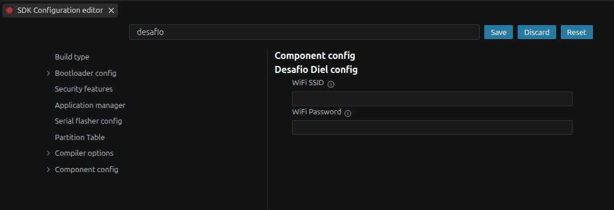
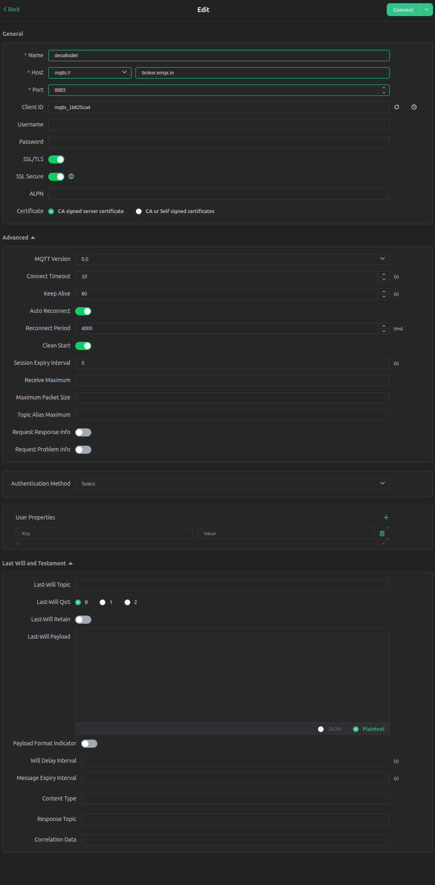
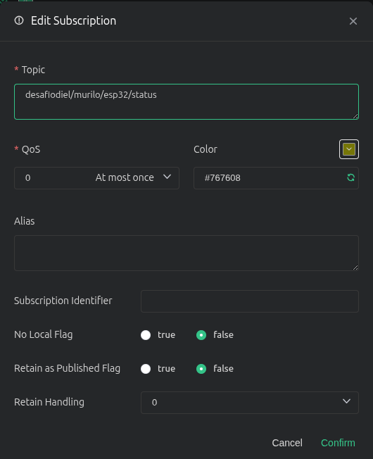
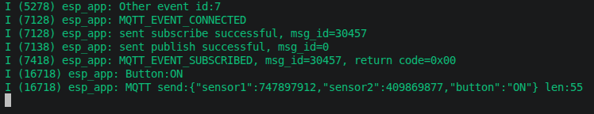

# Desafio diel

Projeto destinado a solução de desafio da diel telemetria pra sensores utilizando mqtt.

## Como usar este projeto

Nesta seção apresento como configurar, compilar e gravar este projeto para rodar em um ESP32. Para compilar e gravar este projeto é necessário um ambiente de desenvolvimento (IDE) com ESP-IDF v6.0.2 previamente instalado, informações sobre como [instalar espidf](https://docs.espressif.com/projects/esp-idf/en/v6.0.2/esp32/get-started/index.html).

### Requisitos do projeto

- Para executar este projeto será necessário apenas um kit de desenvolvimento ESP32-WROOM32.
- Ponto de acesso a internet WiFi 2.4GHz.
- Um cliente MQTT para visualizar as mensagens trocadas com o broker e enviar comandos para o ESP32. Recomendo a utilização do cliente MQTT [MQTTX](https://mqttx.app/) com as configurações da seção [MQTT](#configurar-o-projeto).

### Configurar o projeto

Antes de compilar o projeto abra o menuconfig e altere os campos destinado a credenciais de conexão WiFi. Utilize o comando abaixo para acessar o menuconfig ou no vscode utilize o atalho do esp-idf:explorer->menuconfig.

```bash
idf.py menuconfig
```

#### Acesso a internet Wifi
Na caixa de busca procure por "desafio" e preencha os campos WiFi SSID e WiFi Password com os correspondente de sua rede para conectar o dispositivo na internet. Certifique-se que sua rede esteja ao alcance do dispositivo e que o ponto de acesso seja 2.4GHz. Salve as configurações do menuconfig.



#### Cliente mqtt
Para acessar as informações que o dispositivo envia para o broker, utilize um aplicativo mqtt-client, sugiro o uso do [MQTTX](https://mqttx.app/downloads), crie uma nova conexão configure os campos destacado na imagem abaixo com os mesmos valores e garanta que o botão SSL/TLS esteja ativo. Clique no botão Connect.



Após conectar ao broker clique no botão 'New Subscription' e insira o nome do tópico para se inscrever, conforme a imagem abaixo:



Tópicos utilizados neste projeto para o dispositivo enviar dados para o broker
```bash
desafiodiel/murilo/esp32/status
```

Tópicos utilizados neste projeto para enviar comandos para o dispositivo através do MQTTX
```bash
desafiodiel/murilo/esp32/cmd
```

### Compilar e gravar

Antes de compilar o projeto certifique-se o código encontra-se na release-v1.0, abra o esp-idf terminal verifique em qual endereço associado ao dispositivo e execute o comando:

```bash
idf.py -p /dev/ttyUSBx build flash monitor
```

### Saída esperada
O funcionamento correto deve apresentar a saída abaixo:



## Contribuindo

Pull requests são bem vindos. Para mudanças maiores por favor abra um apontamento de problema primeiro para discutir o que gostaria de mudar.ge.

Por favor atualize testes de forma apropriada.

## Licenças

[MIT](https://choosealicense.com/licenses/mit/)